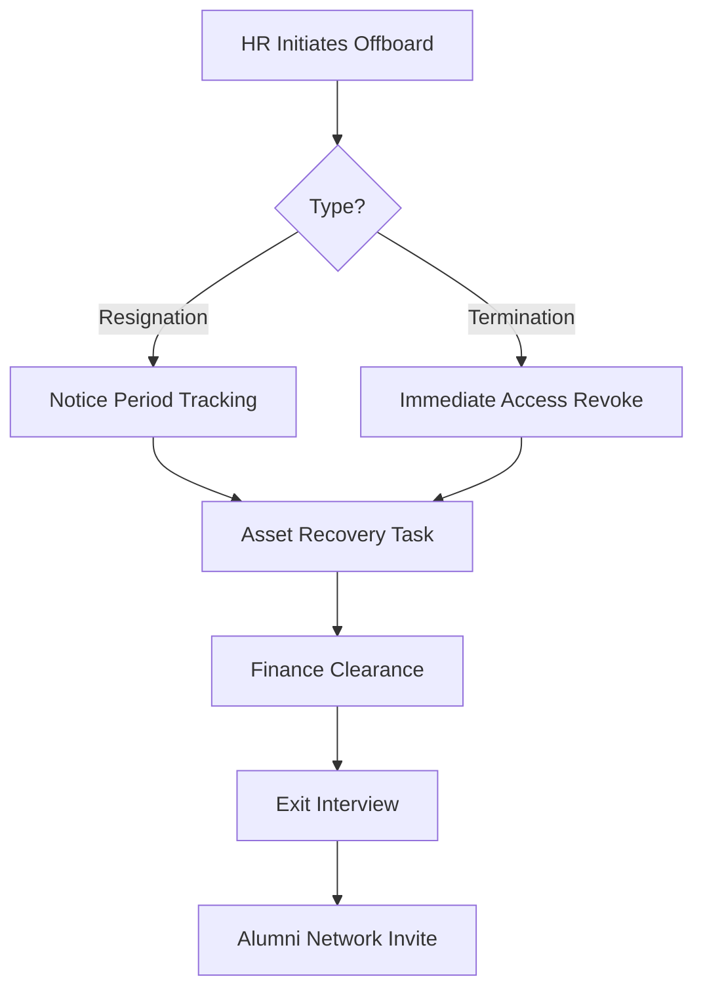

# Employee Transition Management System

## 📌 Executive Summary

This project documents the **Business and Product requirements** for an enterprise-grade Employee Transition System. The system manages the complex lifecycle of employees, including Onboarding, Offboarding, Internal Mobility, and Role Changes. It ensures compliance, asset security, and a seamless user experience for HR and Staff.

**Objective**: To streamline the transition process, ensuring 100% asset recovery during offboarding and Zero-Day productivity for new hires.

---

## 📂 Repository Structure

The documentation is organized by functional area:

| Document | Description |
| :--- | :--- |
| **[User Requirements](./documentation/01_Requirements.md)** | User Stories, Personas, and NFRs (RBAC, Security). |
| **[Workflows](./documentation/02_Workflows.md)** | Visual Mermaid diagrams for Onboarding and Offboarding pipelines. |
| **[Data Model](./documentation/03_Data_Model.md)** | ER Diagram and Data Dictionary. |
| **[API Specification](./documentation/04_API_Endpoints.md)** | Endpoints for Auth, Employee Management, and Transitions. |
| **[KPIs & Risks](./documentation/05_KPIs_and_Risks.md)** | Success metrics, Risk matrix, and SWOT analysis. |
| **[Legacy Notes](./documentation/legacy_details.md)** | Original raw requirement notes. |

---

## 🔄 Core Workflows

### 1. Offboarding Flow
Ensures secure exit management.

### 2. Onboarding Flow
Ensures new hires are ready on Day 1.

*   **Pre-boarding**: Document collection, Laptop provisioning.
*   **Day 1**: System access generation, Orientation scheduling.
*   **Probation**: 30/60/90 day check-ins.

---

## 📝 Key Modules

*   **Asset Management**: Tracking laptops, keycards, and licenses.
*   **Access Control**: Automated provisioning/deprovisioning of IDPs (Google Workspace, Slack, Jira).
*   **Knowledge Transfer**: Workflow for handing over tasks and documents.
