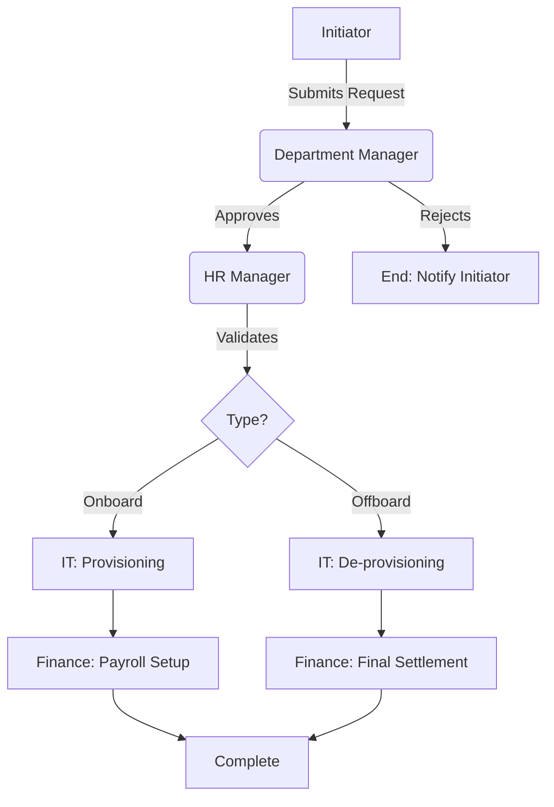

# Process Workflows

## 1. General Transition Logic
All transitions follow a standardized approval pipeline to ensure accountability.

## 2. Onboarding Workflow
Focuses on "Day 0" readiness.

1.  **HR** initiates "New Hire" entry.
2.  **System** generates checklist (Laptop, Email, keycard).
3.  **IT & Facilities** receive parallel tasks.
4.  **Manager** confirms "Desk Ready".
5.  **Employee** receives "Welcome Packet" email on Day 1.

## 3. Offboarding Workflow
Focuses on Asset Recovery and Security.

1.  **Employee/Manager** submits "Resignation/Termination".
2.  **HR** sets "Last Working Day" (LWD).
3.  **System** triggers "Revoke Access" scheduled for LWD + 18:00.
4.  **IT** logs asset return status (Laptop, Phone).
5.  **Finance** processes "Full & Final" settlement only after IT clearance.
