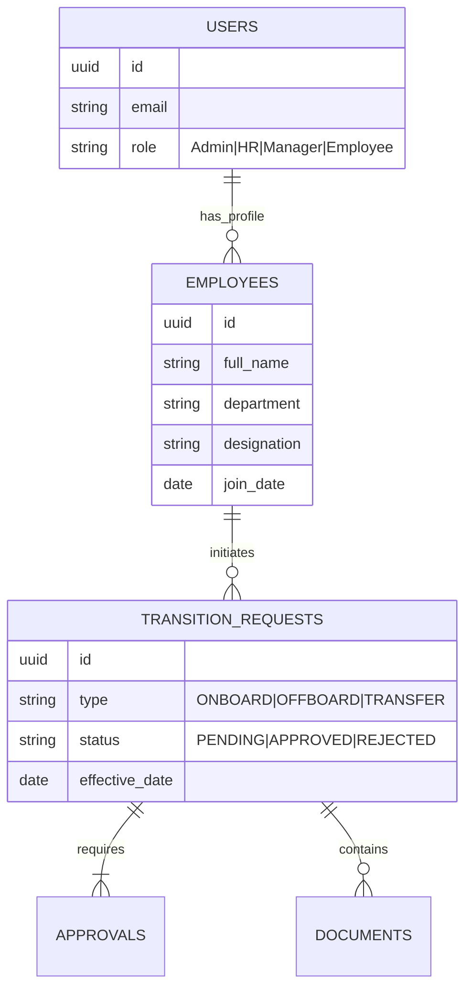

# Data Model & Schema

## 🗄️ Database Schema (ERD)

The system uses a relational database to track users, requests, and documents.

## 📋 Data Dictionary

| Table | Review | Description |
| :--- | :--- | :--- |
| **Users** | Core Auth | Stores login credentials and system roles. |
| **Employees** | Profile | HR-centric details (Department, Manager ID, etc.). |
| **Requests** | Transaction | The central entity linking an employee to a transition event. |
| **Approvals** | Audit | Logs who approved what and when. One request has multiple approval rows (Manager, HR, IT). |
| **Documents** | Assets | Links to uploaded files (Resignation Letter, Offer Letter, Clearance Form). |
